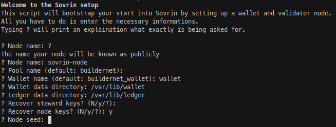

# Sovrin container
> Containerized setup for a Sovrin buildernet node

## Table of contents
* [General info](#general-info)
* [Technologies](#technologies)
* [Setup](#setup)
* [Features](#features)
* [Status](#status)

## General info
This project consists of two container images, an indy-cli client image and a node image as well as various wrapper layer to facilitate an easy and sane setup.

The images are self-contained, have no dependencies to eachother or any other logic outside of themselves and can be used on their own.

## Screenshots


## Technologies
* Docker or Podman
* Ubuntu 16.04.7 LTS (Xenial Xerus) and Ubuntu 18.04.5 LTS (Bionic Beaver) base images
* Wrapper for common tasks in Bash

## Setup
While the images can be used on their own as described in their respective README for most usecases the main installation mechanism is through `sovrin-setup.sh`

The script has two operation modes, interactive and non-interactive, with the later being useful for automated deployment environments.
Starting it without any arguments will launch the interactive setup process as depicted in the screenshot above. All required informations can also be supplied as
a file using the `-c` or `--config` flag as shown in the example below.

Both methods will result in the creation of the following data:
* Steward seed (unless given by the user)
* Wallet key
* Steward public and private key pair
* Node seed (unless given by the user)
* Verification node
* BLS public key
* BLS proof of possession

Supplying a steward or node seed allows the recovery of previously used keys in case of a reinstall for example.

## Non-interactive examples
```
$ cat setup_config 
node_name=sovrin-node
pool_name=buildernet
wallet_name=buildernet_wallet
wallet_data_dir=~/data/wallet
ledger_data_dir=~/data/ledger
#steward_seed=
#node_seed=
$ ./sovrin-setup.sh -c ./setup_config
```

## Features
* Guided process to setup a wallet and node
* Isolated images to freely use
* Wrapper for common tasks:
  * Steward key pair and wallet generation
  * Node initialization

To-do list:
* Validator registration wrapper
* Testing for podman environments

## Status
Project is: _in progress_
